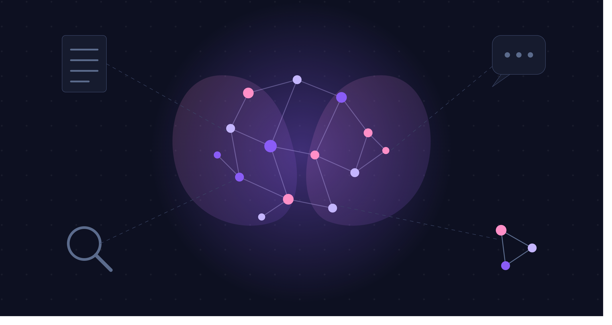
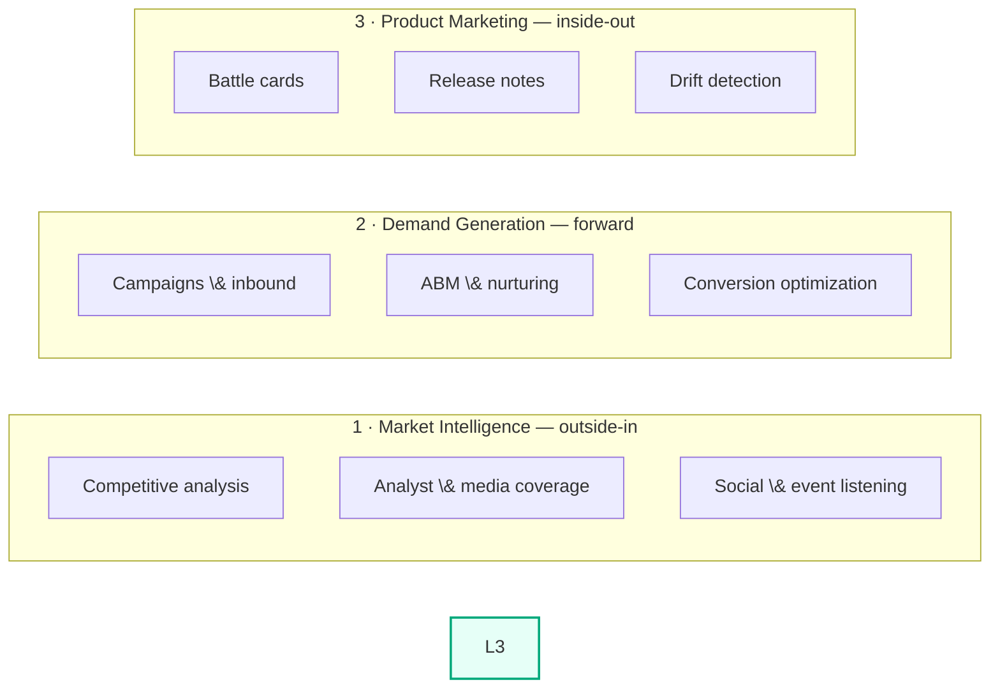
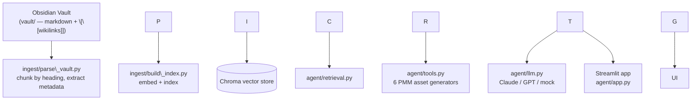

# 🧠 PMM Second Brain

**An AI agent that turns a company's internal knowledge into product marketing assets — and flags when external messaging drifts from internal reality.**


---

## The idea

Most marketers use AI in one of two directions:

* **Market-centric (intelligence)** — outside-in. Competitive analysis, analyst coverage, social listening.
* **Growth (demand generation)** — forward motion. Campaigns, ABM, lead nurturing, conversion optimization.

This project demonstrates a third, underused lane:

* **Company-centric (product marketing)** — inside-out. An AI agent works from the company's *internal* knowledge — specs, tickets, call transcripts, win/loss notes — to produce and maintain PMM assets, and to flag when external messaging no longer matches internal reality.



This repo builds Lane 3 end-to-end for a fictional SaaS company, **FlowPilot** (a workflow automation platform for ops teams), with two fictional competitors (**OpsChain**, enterprise/compliance-focused, and **Routely**, low-cost/SMB) and one recent feature launch (**AutoSync**) that ties the whole dataset together.

---

## How it works



* **`vault/`** is an Obsidian-compatible markdown knowledge base — the "second brain." It represents FlowPilot's internal wiki: product specs, a Jira export, a Slack thread, customer call transcripts, win/loss notes, and competitor profiles, all cross-linked with `\[\[wikilinks]]`.
* **`ingest/`** parses the vault into heading-level chunks, tags each with metadata (`source`, `doc\_type`, `tags`, `related`), and embeds them into a local Chroma vector store.
* **`agent/`** retrieves relevant chunks for each task, fills a prompt template, and asks an LLM for structured JSON — which gets rendered to markdown with a "Sources" footer citing exactly which vault files were used.
* **`agent/app.py`** is a Streamlit UI exposing all six tools.

---

## Quickstart

```bash
git clone https://github.com/yotamgutman/pmm-second-brain.git
cd pmm-second-brain

python -m venv venv \&\& source venv/bin/activate
pip install -r requirements.txt

cp .env.example .env
python -m ingest.build\_index   # builds the vector index from vault/

streamlit run agent/app.py
```

### Run without any API key (demo mode)

Set these in `.env` to run the entire app — UI, retrieval, citations, and all six tools — with zero API keys and no external calls:

```
EMBEDDING\_PROVIDER=local   # or "hash" for a fully dependency-free index
LLM\_PROVIDER=mock
```

In this mode, retrieval is real (you can see exactly which vault files were pulled for each asset), but the generated text comes from hand-written responses grounded in the vault — clearly labeled in the UI as demo mode.

### Run with real generation

```
EMBEDDING\_PROVIDER=local
LLM\_PROVIDER=anthropic
ANTHROPIC\_API\_KEY=sk-ant-...
```

### CLI

Every tool can also be run from the command line, useful for quick checks without the UI:

```bash
python -m agent.cli battle-card OpsChain
python -m agent.cli release-note
python -m agent.cli comparison-table
python -m agent.cli customer-story "Brightline Logistics"
python -m agent.cli drift-check
```

Add `--mock` to any command to force demo-mode generation.

---

## The headline feature: messaging drift detection

The vault's storyline is built around one feature launch, **AutoSync**, which replaced FlowPilot's manual CSV export/import with automated syncing. The launch is fully documented internally — a product spec, a closed Jira epic, and a Slack thread where someone flags that *the website still hasn't been updated*.

The external landing page copy (`vault/external/current-landing-page.md`) was deliberately left as it was **before** the launch. Running the drift checker catches exactly this:

> \*\*🔴 High severity\*\*
> \*\*External claim:\*\* \*"Keeping your data in sync is simple: export your data from FlowPilot as a CSV file, then import it into your other tools whenever you need an update."\*
> \*\*Internal reality:\*\* AutoSync shipped on May 26, 2026 and automatically syncs data with Salesforce, HubSpot, and NetSuite every 15 minutes — manual CSV export/import is no longer the primary sync method for Business and Enterprise customers.
> \*\*Source:\*\* `product/autosync-spec.md`

This is the core "Lane 3" pitch in miniature: the agent isn't scanning the outside world — it's comparing the company's own external messaging against its own internal truth, and catching a gap a busy marketing team plausibly missed for weeks.

---

## Repo structure

```
pmm-second-brain/
├── vault/                          # the "second brain" — Obsidian-compatible markdown
│   ├── Home.md
│   ├── product/                    # spec, roadmap, changelog
│   ├── competitive/                # OpsChain \& Routely profiles, battlecards/ (generated output)
│   ├── customers/                  # win/loss notes, call transcripts
│   ├── engineering/                # Jira export, Slack export
│   └── external/                   # current (outdated) landing page copy — drift target
├── ingest/
│   ├── parse\_vault.py              # walk vault, chunk by heading, extract metadata
│   ├── embeddings.py               # pluggable embedding fn: local | openai | hash
│   └── build\_index.py              # build/query the Chroma index
├── agent/
│   ├── llm.py                      # provider-agnostic JSON completion: anthropic | openai | mock
│   ├── retrieval.py                # retrieval helpers over the vector index
│   ├── tools.py                    # the 6 PMM tools
│   ├── render.py                   # structured output -> markdown
│   ├── cli.py                      # CLI for testing tools without the UI
│   ├── app.py                      # Streamlit UI
│   └── prompts/                    # one markdown prompt template per tool
├── tests/                          # pytest suite, runs on hash + mock (no API keys)
├── .github/workflows/tests.yml     # CI
├── requirements.txt
└── .env.example
```

---

## The six tools

|Tool|Input|What it retrieves|Output|
|-|-|-|-|
|**Battle Card**|Competitor (OpsChain / Routely)|Competitor profile + relevant win/loss notes|Positioning summary, objections + counters + proof points, win themes|
|**Release Note**|Feature (AutoSync)|Product spec + Jira export|Headline, summary, details, known limitations|
|**Comparison Table**|—|All competitor profiles + product spec + roadmap|FlowPilot vs. OpsChain vs. Routely across 5 dimensions|
|**Customer Story**|Customer (Brightline Logistics / Hearth \& Co.)|That customer's call transcript + product spec|Draft case study: challenge, solution, result, quote|
|**Drift Check**|—|Current landing page copy + product spec + Jira export|Flagged mismatches between external claims and internal reality|
|**Ask the Brain**|Free-text question|Semantic search across the whole vault|Grounded answer with citations|

Every output includes a **Sources** footer naming the exact vault files used — the point isn't just "AI writes marketing copy," it's "AI writes marketing copy *and shows its work*."

---

## Testing \& CI

```bash
EMBEDDING\_PROVIDER=hash LLM\_PROVIDER=mock pytest tests/ -v
```

11 tests cover the full pipeline — vault parsing, chunking, wikilink handling, indexing, metadata-filtered retrieval, and all six agent tools (correct sources cited, correct schema shape, drift checker actually flags the planted issue). CI runs this on every push with no API keys or model downloads, using the dependency-free `hash` embedding and `mock` LLM provider.

---

## What this project demonstrates

* **Framework-level thinking** — the three-lanes model, and specifically why Lane 3 (company-centric, inside-out) is the underused one. Strategic/product marketing judgment, not just tooling.
* **RAG architecture** — markdown ingestion, heading-based chunking, metadata tagging, embeddings, vector search with filters.
* **Structured generation** — each PMM asset has its own JSON schema, because real PMM deliverables have *shape*, not just content.
* **Product thinking applied to AI** — the drift checker is a feature *idea*, grounded in a realistic internal-comms scenario (a Slack thread where the to-do gets dropped), not just a RAG tech demo.
* **Engineering practices** — pluggable providers (local/OpenAI/Anthropic/mock embeddings and LLMs), a test suite that runs without secrets, CI, and a CLI for debugging before building UI.

---

## Limitations \& possible extensions

This is a portfolio-scale project with an intentionally small, synthetic dataset (11 vault documents, 1 feature launch, 2 competitors, 2 customers) — enough to make every output traceable and every drift flag verifiable by reading the source files directly.

Possible extensions:

* Replace the synthetic vault with a real (sanitized) Notion/Confluence export.
* Add a scheduled "regenerate on cadence" script, simulating the PMM agent running on its own cadence rather than on demand.
* Local-only mode (local embeddings + a local LLM via Ollama) for a fully offline, zero-API-key demo with real generation.
* Expand "Ask the Brain" into a multi-turn chat interface.

